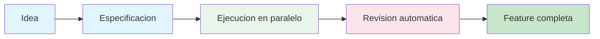
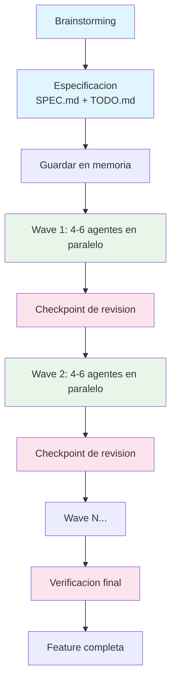
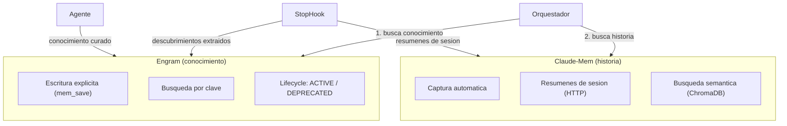
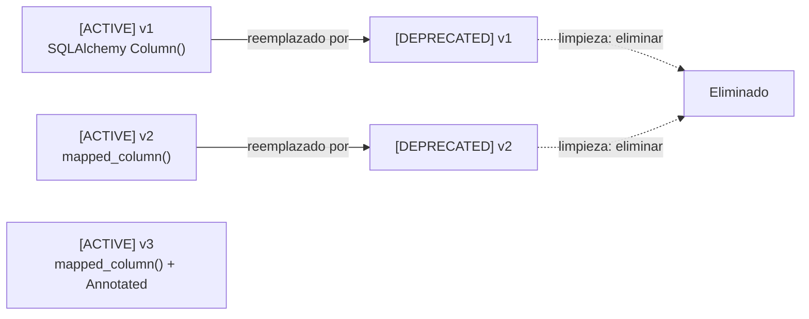
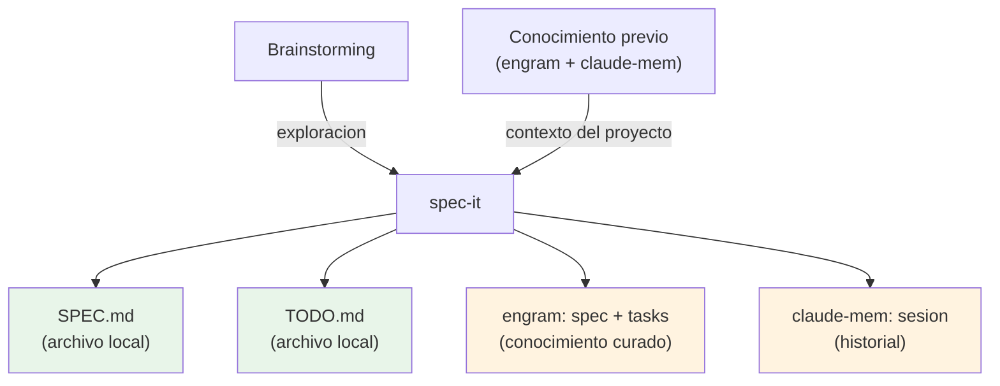
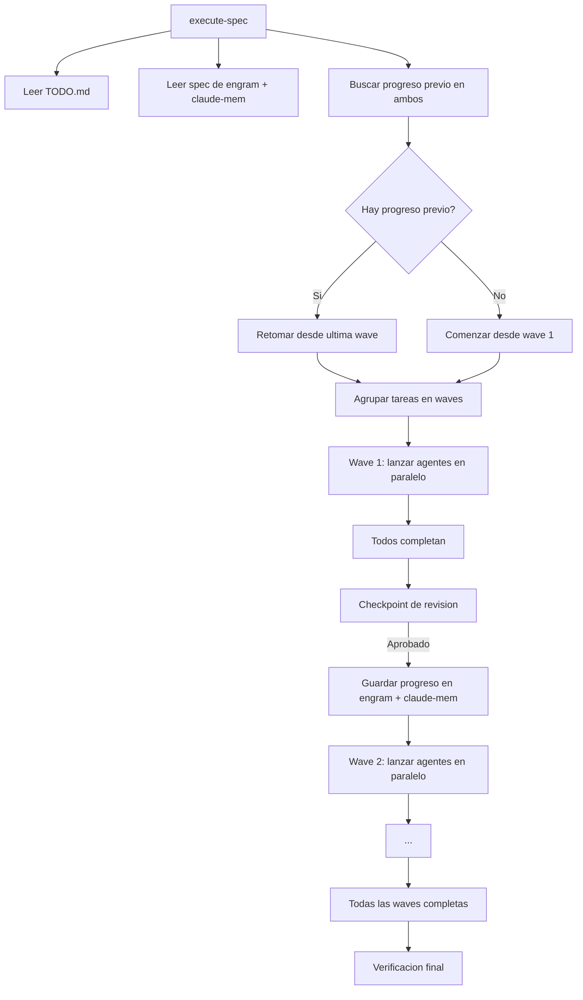
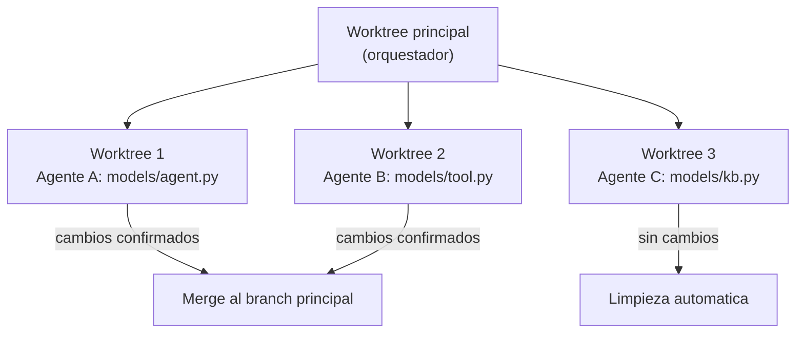
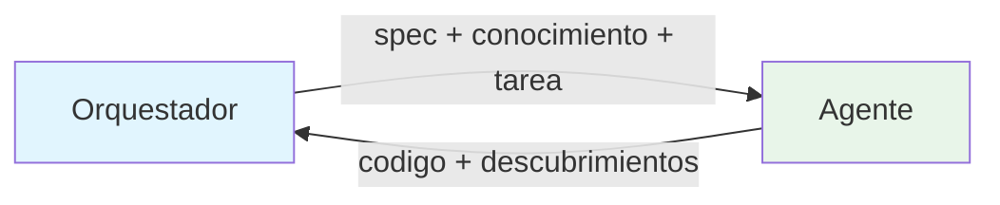
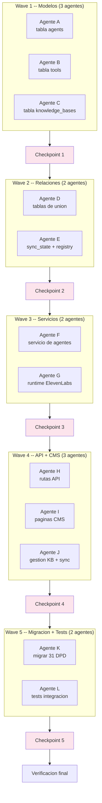

# AryFlow — Desarrollo con IA
**Creado por Alejandro Eslava**
**Kiwi Nexus -- Kiwi Financial Group Inc.**
**Fecha:** 2026-03-22

---

## 1. Resumen Ejecutivo

Kiwi Nexus cuenta con un sistema de desarrollo asistido por inteligencia artificial que permite construir funcionalidades complejas en una fraccion del tiempo habitual. El sistema piensa antes de escribir codigo, recuerda cada decision tomada entre sesiones, ejecuta multiples tareas en paralelo mediante agentes de IA independientes, y revisa automaticamente el resultado de cada fase antes de continuar. El resultado neto es que features que normalmente tomarian dias de trabajo se completan en horas, con mayor consistencia y sin perdida de contexto entre sesiones.

**Por que lo adoptamos:**

- **Velocidad** -- Multiples agentes trabajan simultaneamente, reduciendo tiempos un 60-70%.
- **Calidad** -- Se escribe una especificacion antes de tocar codigo. Cada agente sigue esa especificacion.
- **Retencion de conocimiento** -- Las decisiones arquitectonicas, patrones y convenciones se almacenan y estan disponibles para cualquier agente futuro.
- **Resiliencia** -- Si una sesion se interrumpe, la siguiente retoma exactamente donde quedo.



---

## 2. Como Funciona (vista general)

> **Nota:** Este sistema es project-agnostic. Aunque los ejemplos usan Kiwi Nexus, el mismo flujo funciona en cualquier proyecto. El nombre del proyecto se detecta automaticamente del directorio del repositorio.

El ciclo completo de desarrollo sigue cuatro principios:

### 1. Pensar primero

Antes de escribir una sola linea de codigo, el sistema realiza una fase de brainstorming y especificacion. Se genera un documento de especificacion (SPEC.md) y una lista de tareas (TODO.md). Esto garantiza que todos los agentes que ejecuten el trabajo tengan un plan claro y compartido.

### 2. Recordar todo

Dos sistemas de memoria complementarios aseguran que nada se pierda entre sesiones. Uno almacena informacion de forma explicita y estructurada (engram). El otro captura todo automaticamente como red de seguridad (claude-mem). Las decisiones tomadas en enero estan disponibles para los agentes en marzo.

### 3. Trabajar en paralelo

Las tareas independientes se agrupan en "waves" (oleadas). Dentro de cada wave, entre 4 y 6 agentes de IA trabajan simultaneamente, cada uno en su propia copia aislada del codigo. Esto es como tener un equipo de desarrolladores trabajando al mismo tiempo sin pisarse.

### 4. Revisar siempre

Despues de cada wave, un punto de control (checkpoint) revisa que los cambios cumplan la especificacion, que no haya conflictos, y que se sigan las convenciones del proyecto. Solo despues de pasar la revision se lanza la siguiente wave.



---

## 3. Sistema de Memoria Dual

El sistema utiliza dos memorias que estan SIEMPRE activas simultaneamente. No son respaldo una de la otra -- ambas tienen roles distintos y ambas se consultan siempre.

### Engram -- Base de conocimiento

Engram almacena conocimiento curado y estructurado con gestion explicita de ciclo de vida.

- **Escritura:** Explicita via `mem_save`. Solo conocimiento que pasa los criterios estrictos.
- **Ciclo de vida:** Cada entrada usa marcadores `[ACTIVE]`/`[DEPRECATED]` (siempre en ingles).
- **Contenido:** Specs, tareas, decisiones arquitectonicas, root causes de bugs, convenciones, gotchas.

Cuando un agente descubre algo relevante -- por ejemplo, que la API de ElevenLabs tiene un limite de 10 peticiones por segundo -- lo guarda en engram con una clave clara para que cualquier agente futuro pueda encontrarlo.

### Claude-Mem -- Memoria historica

Claude-mem proporciona captura automatica cronologica y busqueda semantica via HTTP API (respaldado por ChromaDB).

- **Escritura:** Captura automatica en segundo plano + resumenes de sesion via HTTP (`POST http://localhost:3100/api/sessions/summarize`).
- **Ciclo de vida:** Cronologico, SIN marcadores `[ACTIVE]`/`[DEPRECATED]`. Las entradas nunca se deprecan -- forman una linea de tiempo.
- **Contenido:** Resumenes de sesion, historial de trabajo, todo lo que sucedio.

### Tabla comparativa

| Aspecto | Engram | Claude-Mem |
|---------|--------|------------|
| **Proposito** | Base de conocimiento curado | Memoria historica + busqueda semantica |
| **Escritura** | Explicita (`mem_save`, criterios estrictos) | Automatica + resumenes via HTTP API |
| **Lectura** | Por clave exacta (topic key) | Por lenguaje natural / similitud (ChromaDB) |
| **Ciclo de vida** | `[ACTIVE]`/`[DEPRECATED]` obligatorio | Cronologico, sin lifecycle tags |
| **Contenido tipico** | Conocimiento, specs, decisiones | Resumenes de sesion, historial de trabajo |



### Flujo de lectura dual

Al buscar contexto, SIEMPRE se consultan ambos sistemas (no es fallback):

1. **Engram primero** -- buscar por topic key (`mem_search`, `mem_context`). Esto da conocimiento curado.
2. **Claude-mem segundo** -- buscar por consulta semantica (`search`). Esto da contexto historico y trabajo que no se guardo explicitamente.
3. Ambos resultados son complementarios. Engram da lo que el equipo decidio que es importante. Claude-mem da lo que realmente sucedio.

### Criterios estrictos de guardado en engram

Guardar en engram SOLO si cumple al menos uno:

1. Bug fix con root cause -- "X falla porque Y, solucion: Z"
2. Gotcha/trampa -- algo que desperdicia tiempo si no se sabe
3. Decision arquitectonica con razonamiento -- "elegimos X sobre Y porque Z"
4. Convencion establecida -- "en este proyecto siempre hacemos X"

**NUNCA guardar en engram:** "Implemente X" (esta en git), "Use la herramienta Y" (obvio), "Los tests pasan" (temporal), cualquier cosa en CLAUDE.md o derivable del codigo, reportes de estado, mejores practicas genericas.

### Extraccion de descubrimientos

El Stop hook extrae descubrimientos de los resumenes de sesion (claude-mem) y promueve los que califican a engram como entradas permanentes de conocimiento. Esto conecta ambos sistemas: los resumenes viven en claude-mem, pero los descubrimientos importantes se extraen a engram donde tienen gestion de ciclo de vida.

### Convencion de topic keys

Toda entrada en engram sigue un formato de clave estructurado:

```
{proyecto}/{cambio}/{artefacto}
```

Donde:
- **proyecto** = nombre del repositorio (siempre `kiwi-nexus` para este proyecto)
- **cambio** = nombre del feature o cambio
- **artefacto** = tipo de contenido

**Artefactos del ciclo de vida de un cambio:**

| Artefacto | Topic Key | Quien lo escribe | Quien lo lee |
|-----------|-----------|------------------|--------------|
| Exploracion | `kiwi-nexus/{cambio}/explore` | Brainstorming | spec-it |
| Especificacion | `kiwi-nexus/{cambio}/spec` | spec-it | execute-spec, agentes |
| Tareas | `kiwi-nexus/{cambio}/tasks` | spec-it | execute-spec |
| Progreso | `kiwi-nexus/{cambio}/progress` | execute-spec | execute-spec (para reanudar) |
| Trabajo de agente | `kiwi-nexus/{cambio}/wave-{N}/agent-{tarea}` | cada subagente | waves futuras, debugging |
| Verificacion | `kiwi-nexus/{cambio}/verify` | Verificacion | Orquestador |

**Conocimiento permanente del proyecto:**

| Categoria | Topic Key |
|-----------|-----------|
| Patrones descubiertos | `kiwi-nexus/knowledge/patterns` |
| Decisiones arquitectonicas | `kiwi-nexus/knowledge/decisions` |
| Bugs resueltos | `kiwi-nexus/knowledge/bugs` |
| Convenciones | `kiwi-nexus/knowledge/conventions` |
| Integraciones externas | `kiwi-nexus/knowledge/integrations` |

**Ejemplos reales:**

```
kiwi-nexus/agent-registry-phase1/spec        -- Especificacion del Agent Registry
kiwi-nexus/agent-registry-phase1/tasks       -- Tareas desglosadas
kiwi-nexus/agent-registry-phase1/progress    -- Progreso de ejecucion
kiwi-nexus/knowledge/patterns                -- Patrones descubiertos por agentes
kiwi-nexus/knowledge/decisions               -- Decisiones como "slugs URL-safe unicos"
```

---

## 4. Proteccion contra Conocimiento Obsoleto

El conocimiento se acumula con el tiempo. Sin una estrategia de gestion, las entradas contradictorias se apilan y los agentes reciben instrucciones en conflicto. El sistema utiliza tres capas de proteccion **exclusivamente para engram** (claude-mem es cronologico y no necesita gestion de obsolescencia -- sus entradas forman una linea de tiempo, no un estado mutable).

### Capa 1: Versionado con estado (solo engram)

Cada entrada de conocimiento en engram incluye un marcador de estado:

```
[ACTIVE] 2026-03-22 -- Los modelos SQLAlchemy usan mapped_column()
[DEPRECATED] 2026-03-22 -- Reemplazado por: kiwi-nexus/knowledge/conventions#mapped-column-v2
```

> **Nota:** Los marcadores `[ACTIVE]` y `[DEPRECATED]` se escriben siempre en ingles, independientemente del idioma del texto. Esto asegura que los agentes puedan buscarlos de forma consistente.

Cuando un agente descubre nueva informacion que reemplaza algo existente, marca la entrada antigua como `[DEPRECATED]` con una referencia a la nueva, y guarda la nueva como `[ACTIVE]`.

### Capa 2: Regla de recencia

Cuando existen entradas en conflicto, **la entrada `[ACTIVE]` mas reciente gana**. Los agentes reciben esta instruccion como parte de su contexto. Esta regla resuelve automaticamente el 95% de los conflictos.

### Capa 3: Limpieza periodica

Al final de cada hito (no de cada spec, de cada hito mayor), se realiza una limpieza:

1. Buscar todas las entradas `[DEPRECATED]` del proyecto.
2. Verificar que la entrada que las reemplazo sigue `[ACTIVE]`.
3. Si es asi, eliminar permanentemente la entrada obsoleta.
4. Si la cadena de reemplazos tiene multiples eslabones, seguirla hasta el final y eliminar todos los intermedios.

**Regla fundamental: "El conocimiento no expira por tiempo. Expira por reemplazo."**

Una decision arquitectonica tomada hace seis meses puede seguir siendo valida. No se borra por antiguedad, solo cuando algo la reemplaza explicitamente.



### Anti-patrones (nunca hacer esto)

| Anti-patron | Por que falla |
|-------------|---------------|
| Expirar por tiempo (borrar despues de 30 dias) | Decisiones de hace 6 meses pueden seguir vigentes |
| Borrar todo al iniciar un nuevo spec | Destruye conocimiento valioso entre specs |
| Guardar sin marcador de estado | Genera contradicciones sin forma de resolverlas |
| Guardar todo y nunca limpiar | El contexto se llena de informacion obsoleta |

---

## 5. Flujo de Trabajo SDD

El flujo de desarrollo se divide en dos fases principales: especificacion (spec-it) y ejecucion (execute-spec).

### spec-it -- Especificacion

**Entrada:** Una idea, un feature request, o el resultado de un brainstorming.

**Proceso:**
1. Lee conocimiento previo del proyecto desde engram (`mem_context`) y claude-mem (`search`).
2. Lee la exploracion previa si existe.
3. Genera la especificacion completa y la lista de tareas.

**Salida:**
- `specifications/{cambio}/SPEC.md` -- Especificacion completa (archivo local, legible por humanos)
- `specifications/{cambio}/TODO.md` -- Lista de tareas ordenadas por dependencia (archivo local)
- Entrada en engram con la especificacion (conocimiento curado para agentes)
- Entrada en engram con las tareas (conocimiento curado para agentes)
- Historial de sesion capturado por claude-mem (contexto historico para agentes)



Los archivos locales siguen existiendo para lectura humana. La memoria dual (engram + claude-mem) es complementaria, no un reemplazo.

### execute-spec -- Ejecucion

**Entrada:** El TODO.md local + la especificacion y tareas desde engram + contexto historico desde claude-mem.

**Proceso:**
1. Lee el TODO.md del sistema de archivos.
2. Lee la especificacion desde engram y contexto historico desde claude-mem.
3. Verifica si hay progreso previo en ambos sistemas (en caso de interrupcion).
4. Si hay progreso, retoma desde la ultima wave completada.
5. Agrupa las tareas restantes en waves por dependencias.
6. Por cada wave:
   - Lanza 4-6 agentes en paralelo, cada uno con su propia copia del codigo.
   - Cada agente recibe: la especificacion, el conocimiento del proyecto, y su tarea especifica.
   - Espera a que todos completen.
   - Ejecuta checkpoint de revision.
   - Guarda el progreso en engram; datos de sesion capturados por claude-mem.
7. Verificacion final al completar todas las waves.



La capacidad de reanudar es clave: si la sesion se interrumpe a mitad de la wave 3, la siguiente sesion lee el progreso de engram y el historial de claude-mem, y retoma exactamente desde la wave 3.

---

## 6. Orquestacion de Agentes

### Waves (oleadas)

Las tareas se agrupan en oleadas segun sus dependencias. Dentro de una wave, todas las tareas son independientes entre si y pueden ejecutarse en paralelo.

**Reglas de dimensionamiento:**

- Maximo 4-6 agentes por wave (limite de recursos del sistema).
- Las tareas dentro de una wave no deben editar los mismos archivos.
- Cada wave tiene un checkpoint obligatorio antes de pasar a la siguiente.
- Si un agente falla, el resto no se ve afectado -- la tarea fallida se reintenta o se escala.

### Model mixing (mezcla de modelos)

No todas las tareas requieren el mismo nivel de capacidad cognitiva. Usar el modelo adecuado para cada tipo de tarea optimiza calidad y costo.

| Tipo de tarea | Modelo | Razon |
|---------------|--------|-------|
| Brainstorming / Diseno | Opus | Requiere pensamiento creativo, explorar compromisos |
| Escritura de especificaciones | Opus | Requiere precision, completitud, anticipar casos borde |
| Implementacion de codigo | Sonnet | Sigue especificaciones bien, costo-eficiente en volumen |
| Escritura de tests | Sonnet | Sigue patrones establecidos, repetitivo |
| Verificacion | Sonnet | Sistematico, basado en checklist |
| Consultas rapidas | Haiku | Rapido, economico, suficiente para consultas factuales |

**Impacto en costo:** Un feature tipico de 20 tareas usa Opus para 2 tareas (brainstorming + spec) y Sonnet para 18 (implementacion + tests + verificacion). Esto reduce el costo aproximadamente un 70% comparado con usar Opus para todo, sin perdida medible de calidad en las tareas de implementacion.

### Worktrees (copias aisladas)

Cada agente que modifica codigo trabaja en su propio "worktree" -- una copia aislada del repositorio basada en el branch actual. Esto previene conflictos entre agentes que trabajan en paralelo.



- Cada agente que toca codigo recibe su propio worktree.
- Al completar, sus cambios se integran de vuelta al branch principal.
- Si no hubo cambios, el worktree se limpia automaticamente.
- Si hay conflictos de merge, se resuelven en el checkpoint de revision.

### Agente de merge dedicado

Despues de cada wave, un agente especializado se encarga de integrar el trabajo:

1. Lee el spec para entender el contexto completo.
2. Recoge todas las ramas de los worktrees de la wave.
3. Hace merge una por una al branch principal, en orden de dependencia.
4. Si hay conflictos de merge:
   - Lee ambos lados del conflicto + el spec.
   - Resuelve automaticamente si la resolucion es clara desde el spec.
   - **Escala al desarrollador SOLO si el conflicto es ambiguo.**
5. Instala dependencias **una sola vez** despues del merge (no por cada worktree).
6. Ejecuta verificaciones del proyecto.
7. Produce un resumen: que cambio cada agente, que se integro, conflictos resueltos.

Esto libera al desarrollador de entender exactamente que modifico cada agente. El merge agent tiene el contexto completo para resolver conflictos inteligentemente.

### Optimizacion de dependencias

Los worktrees comparten el directorio `.git` pero NO comparten `node_modules` ni entornos virtuales de Python. Para evitar instalar dependencias N veces:

- Los subagentes **no instalan dependencias**. Solo modifican archivos fuente.
- El **agente de merge instala una sola vez** despues de integrar todos los cambios.
- Si un agente necesita agregar un paquete nuevo, modifica el archivo de manifiesto (`package.json`, `requirements.txt`) pero no ejecuta el install.
- Resultado: una sola instalacion por wave, sin importar cuantos agentes participaron.

### Protocolo de contexto

Cada agente parte con un contexto en blanco -- no sabe nada a menos que el orquestador se lo indique. El orquestador prepara un bloque de contexto estructurado que incluye:

1. **Especificacion**: la spec completa desde engram + contexto historico desde claude-mem.
2. **Conocimiento del proyecto**: patrones y convenciones desde engram, decisiones previas desde claude-mem.
3. **Tarea especifica**: exactamente que debe hacer este agente.
4. **Modelo asignado**: segun el tipo de tarea.
5. **Modo de aislamiento**: worktree si toca codigo.
6. **Reglas de escritura**: donde guardar descubrimientos, como marcar conocimiento nuevo.



---

## 7. Ejemplo Concreto: Agent Registry

Este ejemplo recorre la ejecucion real de la Fase 1 del Agent Registry: 7 tablas de base de datos, capa de servicios, rutas API y paginas CMS.

### Wave 1 -- Modelos independientes (3 agentes)

Tres agentes crean simultaneamente las tablas principales de la base de datos:

- **Agente A**: tabla `agents` + migracion Alembic
- **Agente B**: tabla `tools` + migracion Alembic
- **Agente C**: tabla `knowledge_bases` + migracion Alembic

Los tres trabajan en paralelo. Cada uno lee la especificacion desde engram, contexto historico desde claude-mem, y sigue las convenciones del proyecto. El Agente A descubre que el proyecto usa `mapped_column()` consistentemente y lo guarda como conocimiento del proyecto.

**Checkpoint 1**: El orquestador verifica que los tres modelos usan nombres consistentes, no hay conflictos. Merge de worktrees. Aprobado.

### Wave 2 -- Tablas de relacion (2 agentes)

- **Agente D**: tablas de union `agent_tools` + `agent_knowledge_bases`
- **Agente E**: tabla `agent_sync_state` + `service_registry`

Estos dependen de las tablas creadas en Wave 1. Por eso van en una wave posterior.

**Checkpoint 2**: Verificacion de foreign keys y relaciones. Aprobado.

### Wave 3 -- Capa de servicios (2 agentes)

- **Agente F**: servicio y repositorio de agentes (CRUD, busquedas)
- **Agente G**: runtime de ElevenLabs (sincronizacion + ejecucion de llamadas)

**Checkpoint 3**: Verificacion de que el servicio sigue el patron de capas del proyecto. Aprobado.

### Wave 4 -- API y CMS (3 agentes)

- **Agente H**: rutas API (`/api/agents/*`)
- **Agente I**: paginas CMS de lista y detalle de agentes
- **Agente J**: interfaz CMS de gestion de knowledge bases y sincronizacion

Los agentes de CMS ya cuentan con conocimiento acumulado sobre los patrones React y TypeScript del proyecto, descubiertos por agentes en waves anteriores.

**Checkpoint 4**: Verificacion de contrato API, tipado TypeScript. Aprobado.

### Wave 5 -- Migracion y tests (2 agentes)

- **Agente K**: migrar los 31 agentes DPD de variables de entorno al registry
- **Agente L**: tests de integracion del flujo completo

**Checkpoint 5**: Verificacion final. Feature completa.



### Conocimiento acumulado

Al finalizar la Fase 1, el conocimiento del proyecto en la memoria dual ha crecido significativamente (entradas curadas en engram, historial completo en claude-mem):

```
kiwi-nexus/knowledge/patterns
  - [ACTIVE] Patron de modelos SQLAlchemy: mapped_column + Mapped types
  - [ACTIVE] Patron de capa de servicios: metodos async, inyeccion get_db
  - [ACTIVE] Patron de modulos CMS: hooks/ + components/ + types.ts

kiwi-nexus/knowledge/decisions
  - [ACTIVE] ElevenLabs sync usa bloqueo optimista via hash de sync_state
  - [ACTIVE] Los slugs de agentes son URL-safe, derivados del nombre, unicos

kiwi-nexus/knowledge/conventions
  - [ACTIVE] Migraciones Alembic: una tabla por archivo de migracion
  - [ACTIVE] Rutas API: sustantivos en plural, recursos anidados bajo padre

kiwi-nexus/knowledge/integrations
  - [ACTIVE] ElevenLabs API: limite 10 req/s, auth via header xi-api-key
  - [ACTIVE] Twilio llamadas salientes: SID + auth token, webhook para estado
```

Cuando comience la Fase 2, spec-it leera TODO este conocimiento antes de escribir la especificacion. No hay re-descubrimiento. No hay contradicciones. La Fase 2 parte con mejor informacion que la Fase 1 porque el sistema aprendio.

---

## 8. Herramientas y Comandos

### Skills principales

| Skill | Proposito | Modelo tipico |
|-------|-----------|---------------|
| `brainstorming` | Explorar el espacio del problema, generar ideas | Opus |
| `writing-plans` | Estructurar ideas en planes accionables | Opus |
| `spec-it` | Generar SPEC.md + TODO.md + guardar en memoria dual | Opus |
| `execute-spec` | Ejecutar tareas con waves de agentes paralelos | Sonnet |
| `subagent-driven-development` | Lanzar y gestionar agentes paralelos | Sonnet |
| `verification` | Verificar trabajo completado contra la spec | Sonnet |

### Agentes dedicados

| Agente | Proposito | Invocado por |
|--------|-----------|-------------|
| `merge-wave` | Integrar worktrees despues de cada wave, resolver conflictos, instalar deps | execute-spec (automatico) |
| `post-spec-docs` | Actualizar CLAUDE.md, docs, .env.example despues de ejecutar un spec | execute-spec (automatico) |

### Herramientas engram (13 herramientas MCP)

| Herramienta | Descripcion |
|-------------|-------------|
| `mem_session_start` | Iniciar una sesion de trabajo rastreada |
| `mem_session_end` | Finalizar la sesion actual |
| `mem_session_summary` | Generar resumen automatico de la sesion |
| `mem_save` | Guardar contenido estructurado bajo una clave de topico |
| `mem_search` | Busqueda de texto completo en todas las entradas |
| `mem_get_observation` | Obtener contenido completo por ID (obligatorio tras busqueda) |
| `mem_update` | Actualizar una entrada existente |
| `mem_delete` | Eliminar permanentemente una entrada |
| `mem_suggest_topic_key` | Generar una clave de topico consistente |
| `mem_context` | Cargar todo el conocimiento de un proyecto |
| `mem_timeline` | Registro cronologico de eventos del proyecto |
| `mem_stats` | Salud de la base de datos y estadisticas de uso |
| `mem_list_topics` | Listar todas las claves de topico de un proyecto |

### Herramientas claude-mem

| Herramienta | Descripcion |
|-------------|-------------|
| `search` | Busqueda semantica en contenido capturado automaticamente (ChromaDB) |
| `timeline` | Vista cronologica de eventos capturados |
| `get_observations` | Obtener observaciones completas por ID |
| HTTP: `/api/sessions/summarize` | Guardar resumenes de sesion (usado por el Stop hook) |

> **Nota:** Los resumenes de sesion ahora se guardan en claude-mem (via HTTP API), no en engram. Los descubrimientos que califican se extraen del resumen y se promueven a engram como entradas `[ACTIVE]` independientes.

### Cuando usar cada memoria

- **`mem_context(proyecto)`** -- "Dame todo lo que sabes de este proyecto." Conocimiento curado de engram. Usar al inicio de sesion o spec.
- **`mem_search(consulta, proyecto)`** -- "Busca esta cosa especifica." Engram, por topic key.
- **claude-mem `search`** -- "Que decidimos sobre X?" Historia y contexto semantico. Usar SIEMPRE ademas de engram, no como fallback.
- **Regla:** Siempre consultar ambos. Engram primero (conocimiento), claude-mem segundo (historia).

---

## 10. Ejemplos Practicos de Uso

### Ejemplo 1: Flujo completo desde idea hasta PR

Este ejemplo muestra cada paso del ciclo de vida para crear el Agent Registry, incluyendo los comandos que el desarrollador ejecuta y lo que sucede internamente.

**Paso 1 — Brainstorming**
```
> /brainstorm "Agent Registry — crud de agentes con sincronizacion a ElevenLabs"
```
- Claude explora el problema, hace preguntas una por una para entender el alcance
- Genera un documento de exploracion con decisiones y tradeoffs
- Resultado guardado en engram + claude-mem: `kiwi-nexus/agent-registry/explore`
- Propone 2-3 enfoques con recomendacion

**Paso 2 — Especificacion**
```
> /spec-it agent-registry
```
- Lee el conocimiento previo del proyecto desde engram (`mem_context`) y claude-mem (`search`)
- Lee la exploracion del paso anterior desde engram + claude-mem
- Genera `specifications/001-agent-registry/SPEC.md` (especificacion completa: backend, frontend, tests, DB)
- Genera `specifications/001-agent-registry/TODO.md` (tareas con hints de dependencia para waves)
- Guarda ambos en engram (conocimiento curado) + claude-mem (historial) para acceso de agentes

**Paso 3 — Revision del spec**
- Automaticamente invoca `superpowers:requesting-code-review` sobre el SPEC.md
- Revisa: completitud, consistencia de tipos, casos borde faltantes, convenciones del proyecto
- Si encuentra gaps, los corrige en el spec y actualiza memoria dual
- Revisa TODO.md: dependencias correctas, agrupacion de waves optima, todas las tareas representadas

**Paso 4 — Ejecucion con waves paralelas**
```
> /execute-spec 001-agent-registry
```
- Analiza dependencias entre tareas del TODO.md
- Agrupa en 5 waves segun independencia:

  - **Wave 1** (3 agentes paralelos en worktrees): tablas agents, tools, knowledge_bases
  - Merge agent: integra los 3 worktrees, resuelve conflictos, instala dependencias una sola vez
  - Checkpoint: revision → commit: `feat(agents): wave 1 — core models`

  - **Wave 2** (2 agentes): tablas de relacion + sync_state
  - **Wave 3** (2 agentes): capa de servicios + runtime ElevenLabs
  - **Wave 4** (3 agentes): rutas API + paginas CMS
  - **Wave 5** (2 agentes): migracion de datos + tests de integracion

- Cada agente guarda un resumen de su trabajo en engram + claude-mem: archivos creados, decisiones tomadas
- Al cerrar cada wave, se guarda el progreso con resumen de agentes y archivos cambiados
- Progreso guardado en engram + datos de sesion en claude-mem despues de cada wave (permite reanudar)

**Paso 5 — Actualizacion de documentacion**
- Automaticamente se lanza el agente `post-spec-docs`
- Revisa si CLAUDE.md necesita actualizarse (nuevos modulos, endpoints, env vars)
- Actualiza .env.example si hay nuevas variables
- Actualiza docs de arquitectura si cambio la estructura

**Paso 6 — Verificacion**
- Se invoca `superpowers:verification-before-completion`
- Verifica que todos los tests pasen
- Verifica que la implementacion coincida con el spec
- Verifica que no haya regresiones

**Paso 7 — Revision de calidad**
```
> /simplify
```
- Revisa el codigo cambiado buscando: reutilizacion, calidad, eficiencia
- Corrige problemas encontrados (duplicacion, complejidad innecesaria)

**Paso 8 — Commit y PR**
```
> /commit
> /pr
```
- Genera mensaje de commit convencional con resumen de todos los cambios
- Crea pull request con descripcion detallada y checklist

**Resultado:** Feature completa, documentada, testeada, revisada, y lista para code review humano.

---

### Ejemplo 2: Reanudar trabajo interrumpido

La sesion anterior se interrumpio durante la Wave 3 de 5.

```
> /execute-spec 001-agent-registry
```
- execute-spec detecta progreso previo en engram + claude-mem
- Anuncia: "Reanudando desde Wave 3. Waves 1-2 completadas."
- Cruza el progreso con los checkboxes de TODO.md
- Continua desde la Wave 3 sin repetir trabajo previo
- Todo el conocimiento descubierto en Waves 1-2 sigue disponible

Esto es posible porque cada wave guarda su estado en engram y claude-mem al completarse. No se pierde trabajo.

---

### Ejemplo 3: El sistema aprende — cada spec es mejor que el anterior

**Phase 1 completada: Agent Registry Core**

Durante la ejecucion, los agentes descubrieron y guardaron:
- Patron de modelos: `mapped_column()` con `Mapped[]` type hints
- Convenciones API: sustantivos en plural, recursos anidados
- Integracion ElevenLabs: limite 10 req/s, auth via `xi-api-key`
- Patron de modulos CMS: `hooks/` + `components/` + `types.ts`

Todo guardado en `kiwi-nexus/knowledge/*`.

**Phase 2 nueva: Claude Text Runtime**

```
> /spec-it claude-text-runtime
```

spec-it ejecuta `mem_context("kiwi-nexus")` y carga TODO el conocimiento acumulado. Antes de escribir una sola linea de la especificacion, ya sabe:
- El patron exacto de modelos SQLAlchemy a seguir
- Las convenciones de rutas API establecidas
- Los limites de la API de ElevenLabs
- La estructura de modulos del CMS

No re-descubre. Construye sobre lo aprendido. La especificacion de Phase 2 es mas precisa y completa que la de Phase 1 porque el sistema aprendio.

---

## 11. Cuando Usar Branch vs Worktree

El sistema ofrece dos estrategias de aislamiento para el trabajo:

### Branch (rama de git)
- **Cuando usarlo:** trabajo secuencial, specs pequenos (menos de 10 tareas), un solo desarrollador
- **Como funciona:** `git checkout -b feat/{nombre}` crea una rama donde se hacen todos los cambios
- **Ventaja:** simple, familiar, sin overhead adicional

### Worktree (copia aislada)
- **Cuando usarlo:** agentes paralelos que modifican codigo, specs grandes con multiples waves
- **Como funciona:** cada agente recibe una copia temporal del repositorio basada en el branch actual
- **Ventaja:** multiples agentes pueden trabajar simultaneamente sin conflictos de git

### Como se comportan los worktrees

1. Cada subagente que toca codigo recibe `isolation: "worktree"` automaticamente.
2. El sistema crea una copia temporal del repositorio para ese agente.
3. El agente trabaja en su copia aislada — sus cambios no afectan a otros agentes.
4. Al completar:
   - Si hubo cambios: se devuelve la ruta y el branch para merge.
   - Si no hubo cambios: el worktree se limpia automaticamente.
5. En el checkpoint de revision, el orquestador integra (merge) los branches de vuelta al branch principal.
6. Si hay conflictos de merge, se resuelven manualmente en el checkpoint.

### Matriz de decision

| Escenario | Estrategia |
|-----------|------------|
| Escribir un spec (spec-it) | Branch actual o branch nuevo |
| Ejecutar spec con 1 wave a la vez | Branch de feature |
| Waves paralelas, archivos posiblemente compartidos | Worktrees por agente |
| Waves paralelas, archivos 100% diferentes | Mismo branch, sin worktree (mas rapido) |
| Hotfix o cambio rapido | Branch actual |

> **Deteccion automatica:** execute-spec analiza que archivos tocara cada tarea. Si las tareas de una wave tocan archivos completamente distintos (ej: un agente trabaja en `models/agent.py` y otro en `models/tool.py`), no se necesitan worktrees. Solo se usan worktrees cuando hay riesgo de que dos agentes modifiquen el mismo archivo.

---

## 12. Beneficios Clave

- **Flujo de extremo a extremo**: Desde `/brainstorm` hasta `/pr`, cada paso del ciclo esta cubierto: exploracion, especificacion, revision del spec, ejecucion paralela, verificacion, simplificacion, commit y PR. El desarrollador guia el proceso; los agentes ejecutan.

- **Velocidad**: El paralelismo mediante waves reduce los tiempos de desarrollo un 60-70%. Un feature de 20 tareas que tomaria dias de forma secuencial se completa en horas.

- **Calidad**: La metodologia spec-first garantiza que todo el codigo sigue un plan. Los checkpoints de revision automaticos detectan desviaciones temprano, antes de que se acumulen.

- **Conocimiento**: Cada especificacion, decision arquitectonica, patron descubierto y convencion se almacena permanentemente. El sistema aprende con cada feature -- la segunda fase siempre es mejor informada que la primera.

- **Resiliencia**: El progreso se guarda despues de cada wave. Si una sesion se interrumpe, la siguiente retoma exactamente donde quedo. No se pierde trabajo.

- **Costo**: La mezcla de modelos (Opus para diseno, Sonnet para implementacion, Haiku para consultas) reduce los costos de IA aproximadamente un 70% sin sacrificar calidad en las tareas de implementacion.

- **Escalabilidad**: El mismo sistema funciona para un cambio de 5 tareas o un feature de 50. Las waves se adaptan al tamano y complejidad del trabajo.

---

*Documento generado como guia interna de Kiwi Financial Group Inc. Para el documento tecnico completo, consultar el Design Document en `docs/superpowers/specs/2026-03-22-integrated-ai-development-system-design.md`.*
